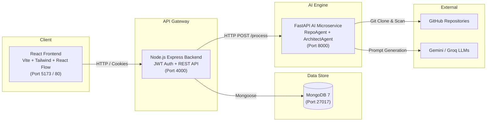

# 🚀 DeployMate Studio

**DeployMate Studio** is an AI-powered AWS Cloud Deployment Workspace that automates repository scanning, cloud infrastructure architecture generation, and visual cloud topology inspection.

---

## 📑 Table of Contents
- [Architecture Overview](#-architecture-overview)
- [Project Structure](#-project-structure)
- [Prerequisites](#-prerequisites)
- [Environment Configuration](#-environment-configuration)
- [How to Run the Project](#-how-to-run-the-project)
  - [Method 1: Docker Compose (Recommended)](#method-1-docker-compose-recommended)
  - [Method 2: Manual Local Execution](#method-2-manual-local-execution)
- [End-to-End User Workflow](#-end-to-end-user-workflow)
- [API Reference](#-api-reference)
- [Troubleshooting & Common Issues](#-troubleshooting--common-issues)

---

## 🏗 Architecture Overview

The system is composed of four primary layers:



| Service | Technology | Port | Description |
|---|---|---|---|
| **Frontend** | React 18, Vite, Tailwind CSS, React Flow | `5173` (Dev) / `80` (Docker) | Dark-mode SPA for workflow orchestration and visual AWS diagrams |
| **Backend** | Node.js, Express, Mongoose | `4000` | REST API gateway, JWT authentication, rate limiting, and project persistence |
| **AI Services** | Python 3.10+, FastAPI, LangChain / LLMs | `8000` | Repository cloning/inspection and AWS architecture synthesis |
| **Database** | MongoDB 7 | `27017` | Document store for users, projects, and AI analysis data |

---

## 📁 Project Structure

```text
AI- Cloud deployment/
├── docker-compose.yml           # Unified multi-container orchestration
├── README.md                    # Root project documentation
├── Ai-servises/                 # Python FastAPI AI Microservice
│   ├── agents/
│   │   ├── Architect agent/     # LLM prompt & architecture agent logic
│   │   └── Repo agent/          # Git clone & repository scanner
│   ├── main.py                  # FastAPI entry point (GET /health, POST /process)
│   ├── Dockerfile
│   └── requirements.txt
│
├── Backend/                     # Node.js Express REST API
│   ├── src/
│   │   ├── config/              # MongoDB & environment variable loaders
│   │   ├── controllers/         # Auth, Project, Analysis controllers
│   │   ├── middleware/          # Auth JWT guard, validation, error handler
│   │   ├── models/              # User, Project, Analysis Mongoose schemas
│   │   ├── routes/              # Express route definitions
│   │   ├── services/            # Project logic & FastAPI client integration
│   │   ├── utils/               # JWT helper & logger
│   │   ├── app.js               # Express application configuration
│   │   └── server.js            # Server listener
│   ├── .env.example
│   ├── Dockerfile
│   └── package.json
│
└── frontend/                    # React 18 Single-Page Application (pure JSX)
    ├── src/
    │   ├── components/
    │   │   ├── architecture/    # React Flow AWS diagram & detail panel
    │   │   ├── layout/          # Sidebar & AppLayout shell
    │   │   └── ui/              # Buttons, Badges, Inputs, Skeleton loaders
    │   ├── context/             # AuthContext (JWT rehydration & session)
    │   ├── pages/               # Landing, Login, Register, Dashboard, NewProject, ProjectDetails, Settings
    │   ├── services/            # Axios API client with interceptors
    │   ├── App.jsx              # Routing & route guards
    │   ├── index.css            # Tailwind directives & custom scrollbars
    │   └── main.jsx             # React entry point
    ├── .env.example
    ├── Dockerfile               # Multi-stage build + Nginx runner
    ├── nginx.conf               # SPA routing & API proxy configuration
    ├── package.json
    ├── tailwind.config.js
    └── vite.config.js
```

---

## ⚙️ Prerequisites

To run DeployMate Studio, ensure you have the following installed:

- **Docker & Docker Compose** (Recommended for easiest setup): [Docker Desktop](https://www.docker.com/)
- *Or for manual setup:*
  - **Node.js** v18 or v20+ and **npm**
  - **Python** 3.10+ and **pip**
  - **MongoDB** Community Server v6 or v7 (running locally or MongoDB Atlas)
  - **Git** installed and available in your `PATH`

---

## 🔐 Environment Configuration

### 1. AI Services (`Ai-servises/.env`)
Create a `.env` file in `Ai-servises/`:
```env
# Choose your preferred LLM provider API key
GEMINI_API_KEY=your_gemini_api_key_here
# or
GROQ_API_KEY=your_groq_api_key_here
```

### 2. Backend (`Backend/.env`)
Create a `.env` file in `Backend/` (or copy from `Backend/.env.example`):
```env
PORT=4000
NODE_ENV=development

# MongoDB Connection
MONGODB_URI=mongodb://localhost:27017/deploymate

# JWT Secret (minimum 32 random characters)
JWT_SECRET=deploymate-super-secret-jwt-key-change-in-production-12345
JWT_EXPIRES_IN=7d

# FastAPI AI Microservice URL
AI_SERVICE_URL=http://localhost:8000

# Frontend URL for CORS
FRONTEND_URL=http://localhost:5173
```

### 3. Frontend (`frontend/.env`)
Create a `.env` file in `frontend/` (optional for dev, defaults to Vite proxy `/api`):
```env
# Optional: In development, leave blank to use the Vite proxy to http://localhost:4000
VITE_API_URL=http://localhost:4000/api
```

---

## 🚀 How to Run the Project

### Method 1: Docker Compose (Recommended)

Run all services (MongoDB, AI Engine, Node.js Backend, and React Frontend) with a single command:

```bash
docker compose up --build
```

Once started:
- 🌐 **Frontend Application**: [http://localhost:5173](http://localhost:5173)
- 🔌 **Backend REST API**: [http://localhost:4000](http://localhost:4000) (Health check: [http://localhost:4000/health](http://localhost:4000/health))
- 🤖 **FastAPI AI Engine**: [http://localhost:8000](http://localhost:8000) (Docs: [http://localhost:8000/docs](http://localhost:8000/docs))
- 🗄️ **MongoDB**: `localhost:27017`

To stop all services:
```bash
docker compose down
```

---

### Method 2: Manual Local Execution

If running each microservice individually on your machine:

#### Step 1: Start MongoDB
Ensure MongoDB is running locally on port `27017`:
```bash
# Verify MongoDB connection
mongosh --eval "db.adminCommand('ping')"
```

#### Step 2: Start the AI Microservice
```bash
cd Ai-servises

# Create virtual environment (optional but recommended)
python -m venv .venv
# Windows:
.venv\Scripts\activate
# macOS/Linux:
source .venv/bin/activate

# Install dependencies
pip install -r requirements.txt

# Start FastAPI server
uvicorn main:app --host 0.0.0.0 --port 8000 --reload
```

#### Step 3: Start the Node.js Backend
```bash
cd Backend

# Install dependencies
npm install

# Start in development mode (with nodemon)
npm run dev
```
The backend will listen at `http://localhost:4000`.

#### Step 4: Start the React Frontend
```bash
cd frontend

# Install dependencies
npm install

# Start Vite dev server
npm run dev
```
Open [http://localhost:5173](http://localhost:5173) in your browser.

---

## 🔄 End-to-End User Workflow

1. **Sign Up & Sign In**:
   - Navigate to `/register` and create an account.
   - Credentials are encrypted using bcrypt (12 rounds) and an HTTP-only JWT session is established.
2. **Dashboard Overview**:
   - View your project portfolio, active deployments, and quick actions.
3. **Create a Project**:
   - Click **"New Project"** and provide:
     - **Project Name** (e.g. `My Next.js API`)
     - **GitHub Repository URL** (public repository)
     - **Branch** (e.g. `main`)
     - **Target AWS Region** (e.g. `ap-south-1`)
     - **Deployment Requirements** (optional hints, e.g. "Needs PostgreSQL, Redis, and high availability")
4. **Step 1: AI Repository Analysis**:
   - In the project detail view, click **"Analyze Repository"**.
   - The FastAPI `RepoAgent` clones the repository, scans package manifests, entry points, frameworks, and dockerfiles, producing a concise technical breakdown.
5. **Step 2: Generate Cloud Architecture**:
   - Click **"Generate Architecture"**.
   - The FastAPI `ArchitectAgent` analyzes project requirements, constructs prompt directives, and prompts the LLM to output a compliant AWS cloud architecture schema.
6. **Step 3: Interactive Topology Visualization**:
   - Inspect the interactive **React Flow diagram** showing AWS compute (EC2/ECS/Lambda), database (RDS/DynamoDB), caching (ElastiCache), storage (S3), and routing (CloudFront/Route53/ALB).
   - Review service-specific badges (`CREATE`, `REUSE`, `MODIFY`), connection topologies, rationale, and security recommendations.
7. **Step 4: Cloud Deployment (Coming Soon)**:
   - Preview upcoming automated Terraform/CDK provisioning and AWS deployment pipeline stages.

---

## 📡 API Reference

### Authentication Endpoints
| Method | Endpoint | Auth Required | Description |
|---|---|---|---|
| `POST` | `/api/auth/register` | No | Register account (`name`, `email`, `password`) |
| `POST` | `/api/auth/login` | No | Authenticate user & issue JWT |
| `GET` | `/api/auth/me` | Yes | Get authenticated user profile |
| `POST` | `/api/auth/logout` | Yes | Clear auth cookie |

### Project Management Endpoints
| Method | Endpoint | Auth Required | Description |
|---|---|---|---|
| `GET` | `/api/projects` | Yes | List all projects belonging to user |
| `POST` | `/api/projects` | Yes | Create a new project |
| `GET` | `/api/projects/:id` | Yes | Get single project details |
| `PATCH` | `/api/projects/:id` | Yes | Update project fields |
| `DELETE` | `/api/projects/:id` | Yes | Delete project & its analysis data |

### AI Orchestration Endpoints
| Method | Endpoint | Auth Required | Description |
|---|---|---|---|
| `POST` | `/api/projects/:id/analyze` | Yes | Trigger FastAPI repository clone & scan |
| `POST` | `/api/projects/:id/architecture` | Yes | Trigger FastAPI AWS architecture generation |
| `GET` | `/api/projects/:id/analysis` | Yes | Retrieve stored analysis & architecture JSON |

### FastAPI Direct Microservice Endpoints
| Method | Endpoint | Description |
|---|---|---|
| `GET` | `/health` | Microservice health check |
| `POST` | `/process` | Dispatches action: `"analyze"` or `"architecture"` |

---

## 🛠 Troubleshooting & Common Issues

### 1. Git Clone Fails in AI Microservice
- Verify that the target GitHub repository is **public**.
- Ensure `git` is installed and accessible from the terminal where `uvicorn` is executing.

### 2. LLM API Key Error
- Ensure either `GEMINI_API_KEY` or `GROQ_API_KEY` is defined in `Ai-servises/.env`.
- Check that the API key has active quota and proper permissions.

### 3. MongoDB Connection Refused
- If running locally, verify `mongod` is running.
- In Docker, ensure `MONGODB_URI` points to `mongodb://mongodb:27017/deploymate` (using the container hostname).

### 4. CORS Errors Between Frontend & Backend
- Verify `FRONTEND_URL` in `Backend/.env` matches the frontend's origin (default `http://localhost:5173`).
- Axios is configured with `withCredentials: true` to handle cookies across origins.

---

## 📄 License
This project is licensed under the ISC License.
